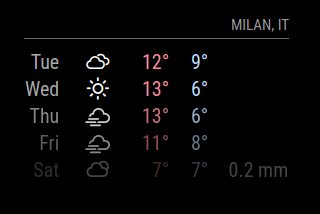

# weatherforecast

## tl;dr

Visualizza il meteo per il numero di giorni specificati.

---

## config.js fragment

```js
{
    module: "weatherforecast",
    position: "top_right",
    config: {
        units: "metric",
        updateInterval: 600000,
        lang: "en",
        initialLoadDelay: 1000,
        colored: true,
        showRainAmount: true,
        maxNumberOfDays: 5,
        roundTemp: true,
        locationID: "",
        appid: "YOUR_OPENWEATHERMAP_APIKEY"
    }
}
```

---

## Proprietà (config section)

| Proprietà          | Tipo      | Valori                                                                                                                                                                                           | Valore Default    | Inderogabilità | Descrizione                                                                                                  |
| ------------------ | --------- | ------------------------------------------------------------------------------------------------------------------------------------------------------------------------------------------------ | ----------------- | -------------- | ------------------------------------------------------------------------------------------------------------ |
| `units`            | `String`  | `config.units`: Acquisizione del valore specificato nel file _config.js_. <br> `"default"`: Kelvin. <br> `"metric"`: Celsius. <br> `"imperial"`: Fahrenheit.                                     | `config.units`    | `OPTIONAL`     | Unità di misura per i gradi.                                                                                 |
| `updateInterval`   | `Number`  | `1000 <= milliseconds <= 86400000`                                                                                                                                                               | `600000`          | `OPTIONAL`     | Frequenza di aggiornamento / richiesta contenuti aggiornati.                                                 |
| `lang`             | `String`  | `config.language`: Acquisizione del valore specificato nel file _config.js_. <br> `"en"` <br> `"nl"` <br> `"ru"` _ect..._.                                                                       | `config.language` | `OPTIONAL`     | Lingua per la visualizzazione del nome dei giorni della settimana.                                           |
| `initialLoadDelay` | `Number`  | `1000 <= milliseconds <= 5000`                                                                                                                                                                   | `0`               | `OPTIONAL`     | Delay di sicurezza prima di avviare il caricamento di questo modulo durante la fase di boot del MagicMirror. |
| `colored`          | `Boolean` | `true`: Attiva la visualizzazione delle temperatura **MIN** & **MAX** in tonalità colorata. <br> `false`: Disattiva la visualizzazione delle temperatura **MIN** & **MAX** in tonalità colorata. | `false`           | `OPTIONAL`     | Attiva la visualizzazione delle temperatura **MIN** & **MAX** in tonalità colorata.                          |
| `showRainAmount`   | `Boolean` | `true`: Attiva la visualizzazione della quantità di precipitazioni (neve, pioggia). <br> `false`: Disattiva la visualizzazione della quantità di precipitazioni (neve, pioggia).                 | `false`           | `OPTIONAL`     | Attiva la visualizzazione della quantità di precipitazioni (neve, pioggia).                                  |
| `maxNumberOfDays`  | `Number`  | `1 <= days <= 16`                                                                                                                                                                                | `5`               | `OPTIONAL`     | Rappresenta il numero di giorni futuri di cui richiedere le informazioni meteo.                              |
| `roundTemp`        | `Boolean` | `true`: Attiva l'approssimazione del valore della temperatura al valore intero più vicino. <br> `false`: Disattiva l'approssimazione del valore della temperatura al valore intero più vicino.   | `false`           | `OPTIONAL`     | Attiva l'approssimazione del valore della temperatura al valore intero più vicino.                           |
| `locationID`       | `String`  | Visita [https://openweathermap.org/](https://openweathermap.org/) per ottenere l'ID zona _(segui istruzioni sotto)_.                                                                             | `---`             | `REQUIRED`     | ID rappresentante univocamente la zona da analizzare per le informazioni meteo.                              |
| `appid`            | `String`  | Visita [https://openweathermap.org/](https://openweathermap.org/) per ottenere la tua API KEY **(ad uso GRATUITO privata)**.                                                                     | `---`             | `REQUIRED`     | La tua API KEY per l'utilizzo della OPENWEATHERMAP API.                                                      |

---

## Screenshots

Schermata del modulo funzionante:



---

## Requisiti Privati

Ottieni la tua API KEY per le API di OPENWEATHERMAP: [https://openweathermap.org/](https://openweathermap.org/).

E' necessaria una API KEY per l'utilizzo del modulo, in quanto quest'ultimo
utilizza le API di OPENWEATHERMAP. L'utilizzo delle API effettuato in modo
automatico da questo modulo è conforme agli standard di utilizzo delle suddette
API, ed è totalmente gratuito (nei limiti di utilizzo privato effettuato
in modo automatico da questo modulo).

---

## locationID

La proprietà `locationID` identifica univocamente una località nell'intero mondo.
Questo codice semplifica l'atto di specificazione della zona da analizzare,
in quanto quest'ultima viene, appunto, identificata univocamente.

Per ottenere il valore di `locationID`:

- Visita prima di tutto: [https://openweathermap.org/](https://openweathermap.org/).
- Utilizza <br>  <br>
  per cercare la tua zona di interesse.
- Una volta effettuata la ricerca <br>  <br>
  potrai notare che l'**URL** della pagina correntemente visualizzata contiene proprio
  il valore di `locationID`: <br>
  
